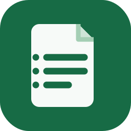

# Konspekt



Windows-приложение для превращения записей BigBlueButton в аккуратные учебные материалы. Оно локально скачивает необходимые дорожки записи, распознаёт речь и текст на экране, собирает контекст и помогает сохранить готовый `lesson.md`.

## Что работает локально

- импорт публичной BBB-записи по ссылке playback;
- извлечение аудио и кадров экрана через FFmpeg;
- транскрибация Faster-Whisper на компьютере;
- OCR кадров через Tesseract;
- контекст для ChatGPT или DeepSeek и сохранение итогового Markdown;
- вход через личный ChatGPT в отдельном окне WebView2 и автоматическое создание `lesson.md` доступной моделью Codex;
- прямое создание `lesson.md` через OpenAI или DeepSeek API по желанию;
- понятные этапы обработки, прошедшее время и возобновление после ошибки.

Аудио, видео и кадры всегда остаются на компьютере. Базовая подготовка полностью локальна. Только после явного выбора личного ChatGPT/Codex или API приложение отправляет текстовый пакет: транскрипцию, текст слайдов и OCR-заметки; ссылка BBB и идентификатор записи из него удаляются. API-ключ защищается средствами текущей учётной записи Windows и не записывается открытым текстом в библиотеку или настройки.

Личный ChatGPT подключается через локально установленный Codex CLI и его [Experimental app-server](https://learn.chatgpt.com/docs/app-server). Konspekt показывает одно отдельное окно WebView2 только для ручной авторизации OpenAI; DOM страницы, cookies и ответы ChatGPT не считываются. Интерфейс чата `chatgpt.com` внутри приложения не показывается. После входа приложение предлагает только доступные аккаунту модели Codex и не обещает набор обычных моделей ChatGPT.

По умолчанию Faster-Whisper использует более быструю модель `base`. В настройках можно выбрать `tiny`, `base` или более точную `small`. При первом использовании выбранная открытая модель скачивается один раз и не расходует API-токены.

## Быстрый старт для разработки

1. Установи Python 3.10+ и, если нужен вход через личный ChatGPT, [Codex CLI](https://learn.chatgpt.com/docs/developer-commands). Убедись, что команда `codex --version` доступна в PowerShell.
2. Выполни:

   ```powershell
   python -m venv .venv
   .\.venv\Scripts\python.exe -m pip install -e ".[local-ai]"
   .\.venv\Scripts\pythonw.exe -m konspekt
   ```

3. В приложении добавь ссылку BBB, нажми «Подготовить», затем «Собрать пакет».
4. Выбери личный ChatGPT/Codex, отдельный OpenAI/DeepSeek API либо ручной чат DeepSeek. В первом варианте войди в одном auth-окне WebView2, выбери доступную модель Codex и дождись автоматического сохранения `lesson.md`.

`scripts\setup_local_ai.ps1` и `scripts\run_konspekt.bat` делают то же самое. Прямые команды выше пригодятся, если Windows запрещает запуск `.ps1`-сценариев.

Для OCR экрана установи Tesseract:

```powershell
winget install UB-Mannheim.TesseractOCR
```

Подробности: [локальная обработка](docs/local-ai.md).

## Готовая Windows-версия

Собери приложение командой:

```powershell
.\scripts\build_konspekt.ps1
```

Результат: `dist\Konspekt\Konspekt.exe`. Копируй всю папку `dist\Konspekt`, а не только `.exe`: рядом лежат FFmpeg, Tesseract, pywebview/pythonnet, локальные библиотеки и иконка приложения. Codex CLI и Microsoft Edge WebView2 Runtime устанавливаются отдельно. Инструкция для получателя: [docs/release.md](docs/release.md).

## Структура проекта

```text
src/konspekt/          исходный код приложения и BBB CLI
tests/                 модульные тесты
assets/                единая SVG, PNG и ICO-иконка Konspekt
scripts/               настройка, запуск, сборка и генерация иконки
packaging/             PyInstaller-спецификации
docs/                  инструкции по локальному ИИ и выпуску
pyproject.toml         зависимости и точки входа пакета
```

Основной запуск — `python -m konspekt` или команда `konspekt` после установки пакета. Корневые `study_app.py` и `bbb_import.py` оставлены только как короткие совместимые обёртки для старых запусков.

## Проверка

```powershell
$env:PYTHONDONTWRITEBYTECODE = '1'
$env:PYTHONPATH = "$PWD\src"
.\.venv\Scripts\python.exe -m unittest discover -s tests -v
```

## Дополнительная CLI-утилита

Старый BBB-загрузчик сохранён отдельно от интерфейса. Он скачивает запись и при необходимости собирает MP4:

```powershell
python -m konspekt.bbb_download "https://host/playback/presentation/2.0/playback.html?meetingId=..."
```

Для него есть отдельная сборка: `scripts\build_bbb_downloader.ps1`.
