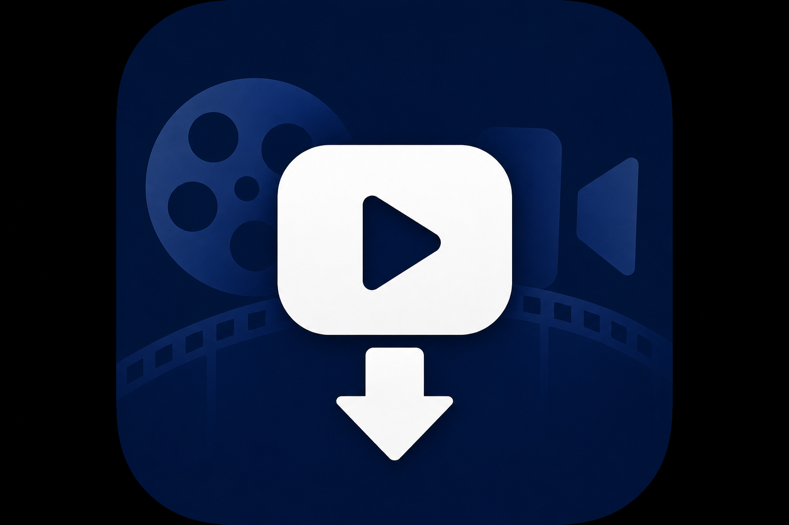

# BBB-to-video-file



Скачивает видео из записей BigBlueButton по ссылке playback и собирает один MP4.

## Что скачивается

Из URL вида:

`https://bbb-lb.tsi.lv/playback/presentation/2.0/playback.html?meetingId=...`

программа загружает:

| Файл | Содержимое |
|------|------------|
| `video/webcams.webm` | Камера + звук |
| `deskshare/deskshare.webm` | Презентация / демонстрация экрана |

Затем ffmpeg конвертирует webm в MP4 и собирает `{meetingId}_merged.mp4`: презентация слева, камера справа, звук из webcams.

## Требования

- Python 3.10+
- [ffmpeg](https://ffmpeg.org/) в PATH

Установка ffmpeg на Windows:

```powershell
winget install ffmpeg
```

Или скачайте сборку с [ffmpeg.org](https://ffmpeg.org/download.html) и добавьте в PATH.

## Установка (локальные библиотеки в `.venv`)

```powershell
cd BBB-to-video-file
.\setup.ps1
.\.venv\Scripts\Activate.ps1
```

Или вручную:

```powershell
python -m venv .venv
.\.venv\Scripts\pip install -r requirements-dev.txt
```

## Сборка EXE

```powershell
.\build.ps1
```

Готовый файл: `dist\bbb-download.exe` (иконка: `assets/logo.ico`)

Пересобрать иконку из PNG:

```powershell
python scripts/make_icon.py
.\build.ps1
```

ffmpeg по-прежнему нужен отдельно — он не входит в exe и должен быть в PATH для сборки MP4.

## Использование

### Способ 1 — двойной клик (проще всего)

1. Откройте папку `dist\`
2. Запустите **`run.bat`** или **`bbb-download.exe`**
3. Вставьте ссылку playback и нажмите Enter
4. После обработки можно вставить **ещё одну ссылку** или нажать Enter для выхода

Пример ссылки:

`https://bbb-lb.tsi.lv/playback/presentation/2.0/playback.html?meetingId=728ac075c4b73cbef0bbb015e68bd08ee0629c9e-1758971622609`

Скопируйте её из браузера (адресная строка на странице просмотра записи BBB).

### Способ 2 — PowerShell / CMD

```powershell
cd dist
.\bbb-download.exe "https://bbb-lb.tsi.lv/playback/presentation/2.0/playback.html?meetingId=728ac075c4b73cbef0bbb015e68bd08ee0629c9e-1758971622609"
```

Или перетащите ссылку через bat-файл:

```powershell
.\dist\run.bat "https://bbb-lb.tsi.lv/playback/presentation/2.0/playback.html?meetingId=..."
```

### EXE

```powershell
.\dist\bbb-download.exe "https://bbb-lb.tsi.lv/playback/presentation/2.0/playback.html?meetingId=728ac075c4b73cbef0bbb015e68bd08ee0629c9e-1758971622609"
```

### Python

Скачать и собрать MP4:

```powershell
python bbb_download.py "https://bbb-lb.tsi.lv/playback/presentation/2.0/playback.html?meetingId=728ac075c4b73cbef0bbb015e68bd08ee0629c9e-1758971622609"
```

Указать папку вывода:

```powershell
python bbb_download.py URL -o ./my_recordings
```

Только скачать и конвертировать в MP4 без общего merged-файла:

```powershell
python bbb_download.py URL --no-merge
```

## Результат

По умолчанию файлы сохраняются в `./downloads/<meetingId>/`:

- `webcams.mp4` — камера + звук (конвертируется сразу после скачивания)
- `deskshare.mp4` — презентация (если есть)
- `{meetingId}_merged.mp4` — итоговое видео (презентация + камера)

## Ограничения

- Запись должна быть опубликована и доступна без авторизации.
- Чат, курсор и аннотации на слайдах в MP4 не включаются.
- Если презентация была только через загруженные слайды (без deskshare), будет сохранён только webcams.
- Сборка больших записей может занять несколько минут.
